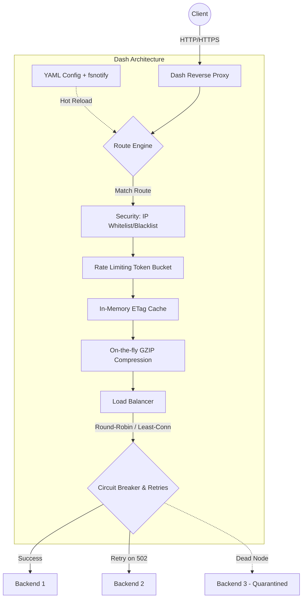

<div align="center">
  
  <h1>Dash - The Ultimate Reverse Proxy & Load Balancer</h1>
  <p>
    <strong>A modern, blazingly fast, and highly resilient core for your network infrastructure.</strong><br>
    <em>Written in Go (Golang) for maximum performance, featuring Zero-Downtime Hot-Reloading.</em>
  </p>

  [](https://golang.org)
  [](https://opensource.org/licenses/MIT)
  []()
  [](https://www.docker.com/)
</div>

---

## 📖 Table of Contents
1. [About Dash](#1-about-dash)
2. [Key Features](#2-key-features)
3. [Quick Start](#3-quick-start)
4. [Architecture Deep Dive](#4-architecture-deep-dive)
5. [Configuration Guide (dash.yaml)](#5-configuration-guide-dashyaml)
6. [Route Engine & Virtual Hosts](#6-route-engine--virtual-hosts)
7. [Load Balancing Algorithms](#7-load-balancing-algorithms)
8. [Reliability: Circuit Breaker & Retries](#8-reliability-circuit-breaker--retries)
9. [On-the-fly GZIP Compression](#9-on-the-fly-gzip-compression)
10. [Security & Rate Limiting](#10-security--rate-limiting)
11. [In-Memory Caching (ETag)](#11-in-memory-caching-etag)
12. [Monitoring & Dashboard](#12-monitoring--dashboard)
13. [Access Logging (JSON)](#13-access-logging-json)
14. [Dynamic Management API](#14-dynamic-management-api)
15. [Production Deployment](#15-production-deployment)
16. [Extending Dash (Middlewares)](#16-extending-dash-middlewares)
17. [Dash vs NGINX / Traefik](#17-dash-vs-nginx--traefik)
18. [FAQ](#18-faq)
19. [Roadmap](#19-roadmap)
20. [Contributing](#20-contributing)
21. [License](#21-license)

---

## 1. About Dash

Dash is an advanced Reverse Proxy and Load Balancer built in Go. It was designed from the ground up for extreme performance, reliability, and ease of management. Serving as a "modern clone" of powerful solutions like NGINX or Apache, it stands out by using innovative, zero-downtime hot-reloading mechanisms for real-time rule configuration.

Moving away from classic, bloated servers configured via unintuitive directives, Dash is tailor-made for microservices architectures. In the era of containerization (Docker, Kubernetes), a proxy must instantly adapt to disappearing and newly spawned backend servers—Dash is ready for this.

By integrating a custom metrics system based on `gopsutil` and WebSockets, Dash combines a robust backend server with a built-in graphical Dashboard. You get not only a networking tool but also full visibility into your infrastructure, with host metrics, CPU, and RAM usage updated every second.

---

## 2. Key Features

### 🚀 Unmatched Performance
- Built on Go's native, highly optimized networking libraries (`net/http`, `httputil.ReverseProxy`).
- Capable of sustaining hundreds of thousands of concurrent connections with a minimal memory footprint (often just tens of megabytes).
- Lock-free or highly-optimized concurrent queuing using `sync.RWMutex` and `sync/atomic`.

### 🔄 Zero-Downtime Hot-Reloading
- Fully integrated with filesystem event tracking (`fsnotify`).
- Automatically reconfigures the routing table and backend pools the moment a write (e.g., Ctrl+S) to `dash.yaml` is detected.
- Backend pools update seamlessly without dropping active connections. Your clients will never see a 5xx error due to a proxy reload!

### 🗺️ Powerful Route Engine & Virtual Hosts
- Routes based on Host headers and Path Prefixes.
- Host dozens of completely isolated web services on a single port (e.g., `80` or `443`).
- Isolate Rate Limiting, Load Balancing strategies, and Caching rules per individual Route.

### ⚖️ Advanced Load Balancing
Distribute traffic across an infinite number of microservices using the optimal strategy for each domain:
- **Round-Robin**: The traditional carousel. Requests are distributed sequentially.
- **Least Connections**: Intelligent routing. Sends new requests to the backend with the fewest active, open HTTP connections.
- **Weighted**: Enforce proportional traffic distribution based on server capacity (e.g., 10:1 ratio for a powerful dedicated server vs. a small VPS).
- **Sticky Sessions**: Automatically binds a client to a specific backend via the `dash_sticky` cookie. Essential for stateful apps, auth, or shopping carts.

### 🛡️ Military-Grade Security
- Built-in Security Middleware acts as a firewall guarding specific routes.
- Full support for **IP Whitelists** (only trusted IPs allowed) and **IP Blacklists** (instant 403 Forbidden for intruders).
- Smart IP resolution accurately identifies the real client IP behind Cloud CDNs by analyzing `X-Forwarded-For` and `X-Real-IP` headers.

### 🚦 Rate Limiting (Token Bucket)
- Precise protection engine based on the Token Bucket algorithm (`golang.org/x/time/rate`).
- Configure Requests per Second (RPS) and Burst limits per client IP.
- Enforce rate limits globally OR specifically on isolated Virtual Hosts (e.g., strictly limit `/auth` while leaving static assets unlimited).

### 🚑 Auto-Healing Infrastructure (Circuit Breaker & Retries)
- Say goodbye to annoying 502 Bad Gateway errors. If a backend fails, the `RetryResponseWriter` absorbs the failure and seamlessly retries the exact request (headers, body, and all) on the next healthy node.
- If a server enters a crash loop (e.g., 5 consecutive transport failures), the **Circuit Breaker** trips. The faulty node is quarantined (marked as Dead) for 15 seconds, preventing cascading failures and giving the node time to recover.

### 🗜️ On-the-fly GZIP Compression
- Dash actively reduces your egress bandwidth costs. The built-in smart compressor inspects incoming backend responses.
- If the content is JSON, text, or HTML, and the client supports it (`Accept-Encoding: gzip`), Dash compresses the payload on the fly.
- Saves 60-90% of bandwidth without requiring any configuration on your backend API servers.

### 💾 In-Memory Caching (ETag)
- Native, lightning-fast in-memory cache store.
- On the first GET request, the server hashes the payload (MD5) to generate a unique `ETag`.
- Subsequent requests from the same client bypass the backend entirely; Dash returns a `304 Not Modified`, drastically reducing database load.
- Honors client-side `Cache-Control: no-cache` headers for forced cache misses.

### 📊 Live Monitoring & Prometheus
- Exposes a `/metrics` endpoint for Prometheus scrapers, exporting dozens of useful counters via `promhttp.Handler`.
- A diagnostic module (`gopsutil`) streams CPU and RAM usage via **WebSockets** every 2 seconds to the built-in `/dash/dashboard`.
- Visual indicators show dead vs. healthy backend nodes at a glance.

### 📜 Structured Access Logging
- Enterprise-grade JSON access logs automatically written to `logs/access.log`.
- Tracks exact timestamps, status codes, Latency (in milliseconds), IPs, and User-Agents. Perfect for ELK (Elasticsearch, Logstash, Kibana) or Datadog integrations.

---

## 3. Quick Start

### Prerequisites
- Go 1.25.0+
- `curl` or `Apache Benchmark (ab)` for testing (optional).

### 3.1. Clone the Repository
```bash
git clone https://github.com/mslotwinski-dev/dash.git
cd dash
```

### 3.2. Install Dependencies
Dash uses several robust external packages (`fsnotify`, `prometheus`, `gopsutil`, `yaml.v3`).
```bash
go mod tidy
```

### 3.3. Run Locally (Development)
The easiest way to explore Dash without compiling:
```bash
go run main.go
```
If successful, you will see:
```text
INFO | Proxy Server running on local ports: :80 and :443
INFO | Configuration file modification detected. Reloading...
```
Navigate to `http://localhost/dash/dashboard` to see the live metrics dashboard!

---

## 4. Architecture Deep Dive

Dash utilizes a carefully structured "onion" architecture, isolating core components for maximum maintainability:

1. **`app` (The Core)**: `app.go` orchestrates the application lifecycle. It wires up Middlewares, initializes the `net/http` servers, and starts listeners. `routes.go` and `router.go` form the "Route Engine", evaluating TCP packets and Host headers.
2. **`config` (Source of Truth)**: Handles the `dash.yaml` parsing using `yaml.v3`. A dedicated goroutine uses `fsnotify` to listen for `Inotify` file write events, triggering a hot-reload without restarting the main server.
3. **`middlewares` (Filters & Firewalls)**: The pipeline HTTP packets must traverse. Includes `GzipMiddleware`, `SecurityMiddleware` (IP filtering), `RateLimitMiddleware`, and the `LoadBalancer`.
4. **`backend` (The Target)**: The `Backend` struct wraps `httputil.ReverseProxy`. It maintains concurrent state regarding active TCP connections (`ActiveConnections`), weights, and failure counters hooked into the Circuit Breaker.
5. **`services` (Telemetry & Utils)**: Infrastructure exports. Feeds Prometheus (`metrics.go`), writes Access Logs (`access_log.go`), and manages WebSocket hubs (`admin.go`).



---

## 5. Configuration Guide (dash.yaml)

The `dash.yaml` file is the heart of the system. If it doesn't exist, Dash generates a default one. Here is a fully expanded example with comprehensive explanations:

```yaml
global:
  # Port for unencrypted HTTP traffic
  http_port: ":80"
  
  # Port for encrypted HTTPS traffic (SSL)
  https_port: ":443"
  
  # Global kill switch for HTTPS (useful for local dev)
  enable_https: false
  
  # Use local/mock certificates instead of Let's Encrypt (Autocert)
  local_https: false
  
  # Force 301 Redirect from HTTP to HTTPS
  redirect_to_https: false
  
  # Domains for which Autocert will automatically provision Let's Encrypt certificates
  autocert_hosts: 
    - "my-awesome-cluster.com"
    - "www.my-awesome-cluster.com"
    
  # Global Cache Time-To-Live
  cache_ttl: "10s"
  
  # Global Rate Limit (Requests Per Second) per IP
  rate_limit_rps: 100
  
  # Maximum burst allowance before triggering 429 Too Many Requests
  rate_limit_burst: 150

security:
  # If non-empty, ONLY these IPs are allowed. All others get 403 Forbidden.
  whitelist: []
    # - "192.168.0.15"
    # - "127.0.0.1"

  # Deny requests from these IPs immediately.
  blacklist: []
    # - "10.0.0.5"

# The Routing Table (Virtual Hosts). You can define unlimited routes!
routes:
  - id: "main-website"
    # Leave empty ("") to match any domain, or specify exactly: "api.domain.com"
    host: ""
    
    # URL Prefix to match. "/" acts as a catch-all.
    path_prefix: "/"
    
    # Load balancing strategy: "round-robin", "least-conn", "weighted"
    strategy: "round-robin"
    
    # Route-specific Rate Limiting (0 = disabled, falls back to global)
    rate_limit_rps: 0
    rate_limit_burst: 0
    
    # The actual backend servers to forward traffic to
    backends:
      - url: "http://localhost:3000"
        weight: 1
      - url: "http://localhost:3001"
        weight: 1
        
  - id: "sensitive-api"
    host: "secure.company.com"
    path_prefix: "/auth/v2"
    strategy: "least-conn"
    # Aggressively limit brute-force attacks on this specific route
    rate_limit_rps: 3
    rate_limit_burst: 5
    backends:
      - url: "http://auth-server:5000"
        weight: 1
```

> **Hot-Reload Magic**: Open `dash.yaml`, change a backend port or tweak the `rate_limit_rps`, save the file, and Dash applies the new rules **instantly** without dropping a single packet.

---

## 6. Route Engine & Virtual Hosts

Routing in Dash operates via a cascading `RouteEngine`. When an HTTP request arrives:

1. **Host Header Inspection**: Matches `r.Host`. If the route restricts traffic to a specific Host and it doesn't match, the engine skips to the next route.
2. **Path Mapping**: Checks `strings.HasPrefix(r.URL.Path, route.PathPrefix)`. 
3. **Per-Route Limiter**: If the route matches (e.g., "sensitive-api"), Dash applies the route's private IP limiter to prevent abuse before forwarding.
4. **Execution**: The request is handed over to the Route's dedicated Load Balancer instance.

Unmatched requests gracefully return an **HTTP 404 Not Found**.

---

## 7. Load Balancing Algorithms

Every Route can define its own `strategy` for distributing traffic:

### 🎲 Round-Robin (`"round-robin"`)
The fairest algorithm in ideal environments. Uses a global counter and modulo arithmetic to sequentially distribute requests across the active backend array (A -> B -> C -> A).

### 📉 Least Connections (`"least-conn"`)
Solves bottlenecks caused by asynchronous requests with varying lifespans. Uses atomic counters (`atomic.AddInt64`) to route traffic to the backend with the absolute lowest number of currently active TCP sockets.

### 🏋️‍♂️ Weighted (`"weighted"`)
Perfect for heterogeneous hardware. If you have a 64-core dedicated server and a 2-core VPS, you can assign weights:
```yaml
backends:
  - url: "http://beefy-server"
    weight: 10
  - url: "http://weak-vps"
    weight: 1
```
Dash probabilistically distributes traffic, giving the beefy server 10x more requests.

### 📎 Sticky Sessions
Enabled by default. Once a client is routed to a backend, Dash injects a `dash_sticky` cookie. Subsequent requests from that client will consistently hit the same backend, preserving session state (JWT/OAuth) or shopping cart data.

---

## 8. Reliability: Circuit Breaker & Retries

### The "RetryResponseWriter"
Standard proxies drop the connection and return 502/503 if a backend fails. Dash uses a `RetryResponseWriter` to buffer the request body. If node `A` refuses the connection or returns a 5xx error, Dash intercepts the failure, selects node `B`, and retries the request transparently. The client never knows a server crashed.

### Circuit Breaker
If a backend node starts spewing errors rapidly, retrying isn't enough—it wastes CPU. Dash tracks Transport Errors. If a node fails 5 times consecutively, the Circuit Breaker trips:
```go
if fails >= 5 {
    b.alive = false
    b.CircuitOpenUntil = time.Now().Add(15 * time.Second)
}
```
The node is marked as "Dead" and isolated from the routing pool for 15 seconds. It is then quietly revived with a clean slate, allowing it a chance to recover.

---

## 9. On-the-fly GZIP Compression

Dash includes a global `GzipMiddleware` optimized for egress bandwidth reduction. 
When a backend returns an uncompressed payload, Dash intercepts it via a `compressResponseWriter`.
- It analyzes the `Content-Type` (targeting `application/json`, `text/*`, `image/svg+xml`).
- If the client header `Accept-Encoding: gzip` is present, Dash compresses the stream on the fly.
- It smartly bypasses compression if the backend already compressed the response, preventing double-encoding overhead.

---

## 10. Security & Rate Limiting

### WAF (Whitelist / Blacklist)
The `security.go` module accurately resolves the real client IP, respecting `X-Forwarded-For` from Cloud CDNs. Blacklisted IPs are instantly dropped with a 403. If the whitelist is populated, the proxy operates in a strict zero-trust mode, dropping all global traffic except the whitelisted IPs.

### Token Bucket Rate Limiting
`IPLimiter` enforces mathematical token bucket constraints (`rate.Limiter`). Unlike a blacklist, it allows legitimate bursts of traffic but returns a sleek JSON `429 Too Many Requests` when limits are breached, preventing DDoS attacks from exhausting your backend resources.

---

## 11. In-Memory Caching (ETag)

A lightning-fast, mutex-protected RAM cache store.
1. On a successful `GET` request, Dash hashes the payload to generate an `ETag` (MD5).
2. The response is cached in memory for the duration of `cache_ttl`.
3. Subsequent requests providing the `If-None-Match` header receive an instant `304 Not Modified`, saving massive amounts of backend processing power.
4. Clients can bypass the cache forcefully by sending `Cache-Control: no-cache`.

---

## 12. Monitoring & Dashboard

Navigate to `/dash/dashboard` to access the built-in control panel.
Powered by WebSockets (`github.com/gorilla/websocket`) and `gopsutil`, Dash streams real-time telemetry every 2 seconds:
- **CPU Utilization (%)**
- **RAM Usage (GB)**
- **Backend Health**: Visual indicators (Red/Green) for every backend across all Virtual Hosts, instantly showing which nodes are healthy and which were isolated by the Circuit Breaker.

For enterprise setups, the `/metrics` endpoint natively exports Prometheus metrics, including HTTP counters and latency histograms.

---

## 13. Access Logging (JSON)

Every HTTP request is comprehensively logged to `logs/access.log` in structured JSON format.
Example log entry:
```json
{"timestamp":"2026-07-20T19:57:42Z","client_ip":"192.168.1.1","method":"GET","path":"/api/login","status":200,"latency_ms":14.3,"user_agent":"Mozilla/5.0 ..."}
```
This structured format is perfectly tailored for ingestion by ELK (Elasticsearch, Logstash, Kibana), Datadog, or Splunk.

---

## 14. Dynamic Management API

Dash includes a hidden Management API at `/dash/api/backends` for dynamic orchestration.
Ideal for Auto-Scaling Groups in AWS/GCP or Kubernetes operators. You can dynamically attach or detach nodes via HTTP:

Add a new node instantly:
```bash
curl -X POST "http://your-dash/dash/api/backends?target=http://new_node:8080"
```

Remove a degrading node gracefully:
```bash
curl -X DELETE "http://your-dash/dash/api/backends?target=http://new_node:8080"
```

---

## 15. Production Deployment

### Linux Kernel Tuning
For extremely high-throughput environments, apply these `sysctl` optimizations (`/etc/sysctl.conf`) to prevent port exhaustion:
```sysctl
fs.file-max = 1000000
net.ipv4.tcp_tw_reuse = 1
net.ipv4.ip_local_port_range = 1024 65535
net.core.rmem_max = 16777216
net.core.wmem_max = 16777216
```

### Docker & Docker Compose
Dash is built as a 12-Factor App. Use this ultra-lightweight Docker setup:

```dockerfile
# Builder
FROM golang:1.25.0-alpine AS builder
WORKDIR /app
COPY . .
RUN go mod download
RUN CGO_ENABLED=0 GOOS=linux GOARCH=amd64 go build -ldflags="-w -s" -o dash-proxy main.go

# Runtime (Scratch/Alpine)
FROM alpine:latest
WORKDIR /root/
COPY --from=builder /app/dash-proxy .
COPY --from=builder /app/dash.yaml .
EXPOSE 80 443
CMD ["./dash-proxy"]
```

**docker-compose.yml**:
```yaml
version: '3.8'
services:
  dash-proxy:
    build: .
    ports:
      - "80:80"
      - "443:443"
    volumes:
      - ./dash.yaml:/root/dash.yaml:ro
      - ./logs:/root/logs
    restart: always
```
*Note: Using a volume for `dash.yaml` ensures that editing the file on the host triggers the hot-reload inside the container instantly!*

---

## 16. Extending Dash (Middlewares)

Want to add custom logic? Dash uses standard `net/http` middleware patterns.
Create a new file in `middlewares/` and write your logic:

```go
package middlewares

import "net/http"

func MyCustomMiddleware(next http.Handler) http.Handler {
    return http.HandlerFunc(func(w http.ResponseWriter, r *http.Request) {
        if r.Header.Get("User-Agent") == "BadBot/1.0" {
            http.Error(w, "Begone, bot!", http.StatusForbidden)
            return
        }
        next.ServeHTTP(w, r)
    })
}
```
Inject it into the chain in `app.go`:
```go
finalHandler := middlewares.MyCustomMiddleware( middlewares.GzipMiddleware( ... ) )
```

---

## 17. Dash vs NGINX / Traefik

- **vs NGINX**: NGINX is a titan but suffers from complex, esoteric configuration syntax. Dash replaces this with clean, readable YAML. NGINX requires `nginx -s reload` (which can cause micro-stutters), while Dash uses `fsnotify` for true zero-impact hot-reloading.
- **vs Traefik**: Both are written in Go and focus on dynamic environments. However, Dash aims for a smaller footprint, stripping away complex Docker/Kubernetes integration layers in favor of raw speed, explicit YAML rules, and built-in interactive dashboards without external dependencies.

---

## 18. FAQ

1. **Why YAML instead of JSON?**
   YAML is significantly more human-readable. It supports comments, lacks annoying braces, and is far easier to edit during a 3:00 AM production incident.
2. **Does it support HTTP/3 (QUIC)?**
   Currently, it supports HTTP/1.1 and HTTP/2 natively. HTTP/3 support is planned for future versions as the Go standard library implementation matures.
3. **Where is the Dashboard?**
   Visit `/dash/dashboard` on the port you configured. Ensure your IP is not blacklisted!

---

## 19. Roadmap

- [ ] **gRPC Support**: Native proxying for modern RPC frameworks.
- [ ] **Advanced WAF**: Built-in SQL Injection and XSS payload detection.
- [ ] **WebAssembly (WASM)**: Write middlewares in Rust or C++ and execute them in Dash via WASM.
- [ ] **Redis Distributed Cache**: Sync cache states across multiple Dash instances horizontally.
- [ ] **OpenTelemetry**: Deep tracing for AWS/GCP integrations.

---

## 20. Contributing

We welcome contributions from the Go community!
1. Fork the repo.
2. Create a feature branch (`git checkout -b feature/AmazingFeature`).
3. Ensure your code is formatted (`go fmt ./...`).
4. Commit your changes (`git commit -m 'feat: Add AmazingFeature'`).
5. Push to the branch (`git push origin feature/AmazingFeature`).
6. Open a Pull Request.

---

## 21. License

Dash is released under the **MIT License**.
You are completely free to use, modify, distribute, and commercialize this software, provided you include the original copyright notice. 

Build freely, scale to the clouds!
